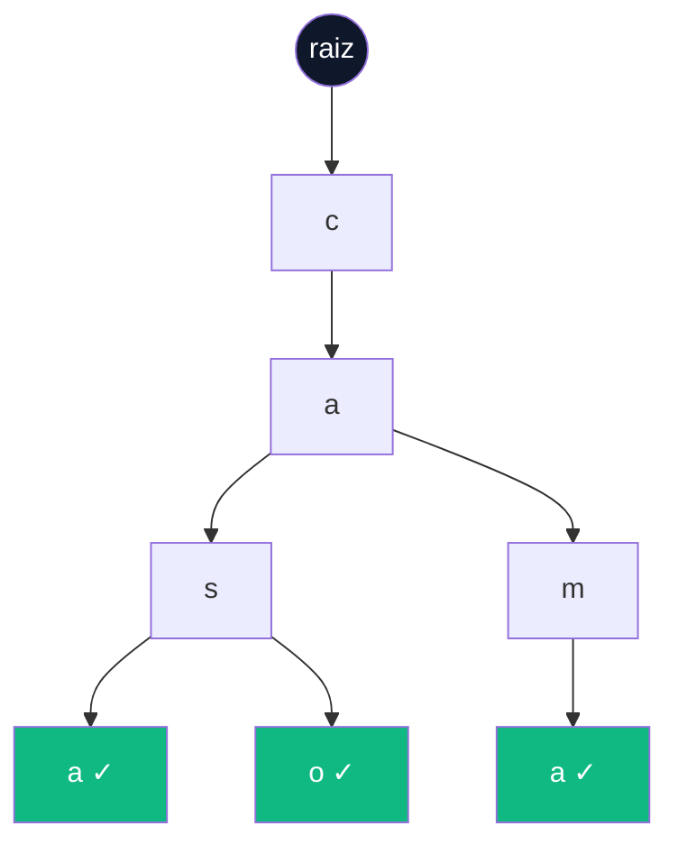

# TrieDS — Sistema de Autocomplete com Árvore Trie

## Resumo

Este trabalho apresenta o desenvolvimento de uma aplicação web interativa para demonstração do funcionamento da estrutura de dados **Árvore Trie** (do inglês *retrieval tree*), aplicada a um mecanismo de sugestão de palavras por prefixo (*autocomplete*). O projeto foi elaborado como atividade avaliativa da disciplina de **Estrutura de Dados**, do curso de **Tecnologia em Sistemas para Internet (TSI)**, com o objetivo de consolidar, na prática, os conceitos teóricos estudados em sala — em especial a representação em árvore, a complexidade assintótica das operações e a manipulação dinâmica do DOM (*Document Object Model*).

---

## 📋 Sumário

- [Resumo](#resumo)
- [1. Introdução](#1-introdução)
- [2. Fundamentação Teórica: a Árvore Trie](#2-fundamentação-teórica-a-árvore-trie)
- [3. Tecnologias Utilizadas](#3-tecnologias-utilizadas)
- [4. Estrutura de Arquivos](#4-estrutura-de-arquivos)
- [5. Implementação da Estrutura de Dados](#5-implementação-da-estrutura-de-dados)
- [6. Integração com a Interface (DOM)](#6-integração-com-a-interface-dom)
- [7. Fluxo de Utilização da Interface](#7-fluxo-de-utilização-da-interface)
- [8. Estilização da Interface](#8-estilização-da-interface)
- [9. Análise de Complexidade (Notação Big-O)](#9-análise-de-complexidade-notação-big-o)
- [10. Instruções de Execução](#10-instruções-de-execução)
- [11. Ferramentas e Uso de Inteligência Artificial](#11-ferramentas-e-uso-de-inteligência-artificial)
- [12. Referências](#12-referências)
- [13. Equipe de Desenvolvimento](#13-equipe-de-desenvolvimento)

---

## 1. Introdução

O **TrieDS** consiste em um painel (*dashboard*) web composto por três módulos funcionais, cada um voltado à demonstração de um aspecto específico da estrutura de dados estudada:

- **Testes de Sugestão** — busca por prefixo executada em tempo real, a cada caractere digitado pelo usuário;
- **Inserção de Dados** — alimentação dinâmica da árvore com novas palavras, com registro visual em formato de tags;
- **Análise de Complexidade** — tabela de referência com a notação Big-O de cada operação implementada.

A aplicação é executada inteiramente no lado do cliente (*client-side*), sem dependência de servidor ou de persistência em banco de dados. Como consequência direta dessa escolha de projeto, o estado da árvore é reconstruído a cada carregamento de página, partindo sempre do conjunto inicial de palavras (`estrutura`, `dados`, `trie`).

---

## 2. Fundamentação Teórica: a Árvore Trie

A **Trie** é uma estrutura de dados em árvore, derivada do termo em inglês *retrieval*, projetada para o armazenamento e a recuperação eficiente de conjuntos de strings. Diferentemente de estruturas como listas ou tabelas hash, a Trie organiza os dados caractere a caractere: cada nó da árvore representa um único caractere, e o caminho percorrido da raiz até um nó marcado como "fim de palavra" corresponde a uma palavra completa armazenada na estrutura.

A figura a seguir ilustra a organização interna da árvore a partir da inserção das palavras `casa`, `caso` e `cama`:



> Os nós destacados em verde (✓) correspondem aos pontos em que a flag `fimDePalavra` é verdadeira, isto é, ao final de cada uma das três palavras inseridas. Observe que o prefixo `"ca"` é compartilhado pelas três palavras e armazenado uma única vez na árvore — esse reaproveitamento de caminhos comuns é a principal vantagem estrutural da Trie em relação a outras estruturas de armazenamento de strings.

A principal vantagem da Trie reside na eficiência da busca por prefixo: ao se buscar pelo prefixo `"ca"`, o algoritmo percorre apenas dois nós (`c` → `a`) para localizar o ponto de bifurcação e, a partir dali, percorre exclusivamente a subárvore correspondente — sem necessidade de comparação com palavras que não compartilham aquele prefixo.

---

## 3. Tecnologias Utilizadas

| Camada | Tecnologia | Função |
|---|---|---|
| Estrutura | HTML5 | Marcação semântica e acessível da interface (uso de `aria-live`, `aria-labelledby`, `sr-only`) |
| Estilo | CSS3 / SCSS | Estilização, design tokens e responsividade |
| Lógica | JavaScript (ES6+, classes) | Implementação da Trie (`trie.js`) e integração com o DOM (`main.js`) |
| Ícones | Font Awesome 6 | Ícones da sidebar e dos cartões |
| Pré-processador | Sass | Organização de variáveis, mixins de breakpoint e componentes |

---

## 4. Estrutura de Arquivos

```
projeto-trie/
│
├── css/
│   └── main.css              # CSS compilado (gerado pelo Sass)
│
├── js/
│   ├── trie.js               # Classes TrieNode e Trie — a estrutura de dados em si
│   └── main.js                # Mapeamento do DOM e eventos que conectam a Trie à interface
│
├── scss/
│   ├── _variables.scss       # Paleta de cores semântica e breakpoints
│   ├── _mixins.scss          # Mixin respond-to() para media queries
│   └── main.scss              # Orquestra layout, grid, cards e componentes
│
├── index.html                # Página principal da aplicação
└── README.md                 # Documentação do projeto
```

---

## 5. Implementação da Estrutura de Dados

A estrutura é implementada em duas classes, conforme o paradigma de orientação a objetos: `TrieNode`, que representa cada caractere da árvore, e `Trie`, que expõe as operações de inserção e busca.

```javascript
class TrieNode {
    constructor() {
        this.filhos = {};          // Mapa de caractere -> TrieNode filho
        this.fimDePalavra = false; // Marca se este nó é o fim de uma palavra válida
    }
}
```

Cada `TrieNode` guarda seus filhos em um objeto comum (`filhos`), usando o próprio caractere como chave. Isso evita ter que percorrer uma lista de filhos a cada passo: o acesso a `noAtual.filhos[char]` é direto. A flag `fimDePalavra` é o que diferencia um nó que é apenas um "caminho" (ex: o `c` de "casa") de um nó que efetivamente fecha uma palavra cadastrada.

### Inserção

```javascript
inserir(palavra) {
    let noAtual = this.raiz;
    for (const char of palavra) {
        if (!noAtual.filhos[char]) {
            noAtual.filhos[char] = new TrieNode();
        }
        noAtual = noAtual.filhos[char];
    }
    noAtual.fimDePalavra = true;
}
```

A inserção percorre a palavra caractere por caractere a partir da raiz. Se o caractere atual ainda não existe como filho do nó corrente, um novo `TrieNode` é criado na hora; se já existe (porque outra palavra com o mesmo prefixo já foi inserida antes), o caminho existente é reaproveitado. Ao final do laço, o último nó visitado é marcado com `fimDePalavra = true`. Esse reaproveitamento de caminhos é o que torna a Trie eficiente em espaço quando há muitas palavras com prefixos em comum.

### Localizando um prefixo

```javascript
_encontrarNo(prefixo) {
    let noAtual = this.raiz;
    for (const char of prefixo) {
        if (!noAtual.filhos[char]) return null;
        noAtual = noAtual.filhos[char];
    }
    return noAtual;
}
```

Antes de sugerir qualquer palavra, é preciso descobrir em qual nó da árvore o prefixo digitado termina. `_encontrarNo` desce a árvore seguindo cada caractere do prefixo; se em algum ponto o caminho não existir, retorna `null` imediatamente — sinal de que nenhuma palavra cadastrada começa com aquele prefixo.

### Coletando as palavras a partir de um nó

```javascript
_coletarPalavras(no, prefixoAtual, resultados) {
    if (no.fimDePalavra) resultados.push(prefixoAtual);
    for (const [char, filho] of Object.entries(no.filhos)) {
        this._coletarPalavras(filho, prefixoAtual + char, resultados);
    }
}
```

Uma vez que se chega ao nó do prefixo, falta descobrir quais ramos abaixo dele terminam em palavras válidas. `_coletarPalavras` faz isso recursivamente: em cada nó, verifica se ele mesmo é fim de palavra (e, se for, adiciona o texto acumulado em `prefixoAtual` à lista de resultados) e então repete o processo para cada filho, sempre concatenando o caractere correspondente. É uma busca em profundidade (DFS) que constrói as palavras de trás para frente, caractere a caractere, conforme desce pela árvore.

### Busca por prefixo (a função pública)

```javascript
buscar(prefixo) {
    const no = this._encontrarNo(prefixo);
    if (!no) return [];
    const resultados = [];
    this._coletarPalavras(no, prefixo, resultados);
    return resultados;
}
```

`buscar()` é o método que a interface efetivamente chama. Ele combina as duas funções anteriores: primeiro localiza o nó onde o prefixo termina e, se ele existir, coleta todas as palavras alcançáveis a partir dali. Se o prefixo não existir na árvore, retorna uma lista vazia em vez de lançar erro — o que simplifica bastante o código do lado do DOM, já que não é preciso tratar `null` na interface.

---

## 6. Integração com a Interface (DOM)

O arquivo `main.js` é responsável por ler o que o usuário digita, repassar para a `Trie` e renderizar o resultado na tela.

### Inicialização

```javascript
const minhaArvoreTrie = new Trie();

['estrutura', 'dados', 'trie'].forEach(p => minhaArvoreTrie.inserir(p));
```

Ao carregar a página, uma única instância de `Trie` é criada e populada com as mesmas três palavras que aparecem como tags estáticas no HTML (`estrutura`, `dados`, `trie`). Isso garante que a interface e a estrutura de dados comecem sincronizadas.

### Renderizar Sugestões

```javascript
function renderizarSugestoes(sugestoes) {
    suggestionsList.innerHTML = '';

    if (!sugestoes || sugestoes.length === 0) {
        const placeholder = document.createElement('li');
        placeholder.classList.add('placeholder');
        placeholder.textContent = trieInput.value.trim() === '' 
            ? 'Aguardando digitação...' 
            : 'Nenhuma sugestão encontrada para este prefixo.';
        suggestionsList.appendChild(placeholder);
        return;
    }

    sugestoes.forEach(palavra => {
        const li = document.createElement('li');
        li.textContent = palavra;
        li.addEventListener('click', () => {
            trieInput.value = palavra;
            renderizarSugestoes([palavra]);
        });
        suggestionsList.appendChild(li);
    });
}
```

A cada chamada, a lista de sugestões é completamente limpa e recriada — o mesmo princípio usado em outros projetos de fila ou histórico: nunca tentar atualizar itens individualmente, e sim redesenhar a lista a partir do estado atual. Quando não há resultados, a função distingue dois cenários através do texto exibido: campo vazio (`"Aguardando digitação..."`) ou prefixo sem correspondência (`"Nenhuma sugestão encontrada..."`). Cada sugestão criada também recebe um clique que a copia para o campo de busca, funcionando como um autocomplete clicável.

### Adicionar Tag Visual

```javascript
function adicionarTagVisual(palavra) {
    const novaTag = document.createElement('span');
    novaTag.classList.add('tag');
    novaTag.textContent = palavra;
    registeredWordsContainer.appendChild(novaTag);
}
```

Diferente da lista de sugestões, as tags do dicionário **não** são redesenhadas do zero — cada nova palavra inserida apenas adiciona uma tag ao final do container existente, preservando as tags anteriores (incluindo as três estáticas do HTML).

### Eventos: o elo entre o usuário e a Trie

```javascript
trieInput.addEventListener('input', (evento) => {
    const prefixo = evento.target.value.trim().toLowerCase();

    if (prefixo === '') {
        renderizarSugestoes([]);
        return;
    }

    const resultados = minhaArvoreTrie.buscar(prefixo);
    renderizarSugestoes(resultados);
});
```

O evento `input` (não `keydown` ou `change`) dispara a cada caractere digitado ou removido, é o que dá a sensação de autocomplete "em tempo real". O texto é normalizado com `trim()` e `toLowerCase()` antes de ir para `buscar()`, já que a Trie é case-sensitive e diferencia espaços — sem essa normalização, "Casa" e "casa" seriam tratadas como palavras diferentes.

```javascript
addWordBtn.addEventListener('click', () => {
    const novaPalavra = wordInput.value.trim().toLowerCase();

    if (novaPalavra === '') {
        alert('Por favor, digite uma palavra válida.');
        return;
    }

    minhaArvoreTrie.inserir(novaPalavra);
    adicionarTagVisual(novaPalavra);
    wordInput.value = '';
    wordInput.focus();
});

wordInput.addEventListener('keypress', (evento) => {
    if (evento.key === 'Enter') {
        addWordBtn.click();
    }
});
```

O botão **Inserir** valida o campo, insere a palavra na Trie e só então atualiza a tag visual — garantindo que a estrutura de dados e a interface nunca fiquem fora de sincronia. O listener de `keypress` no campo de texto simplesmente simula um clique no botão quando o usuário pressiona **Enter**, reaproveitando toda a lógica de validação já escrita, sem duplicar código.

---

## 7. Fluxo de Utilização da Interface

O painel é dividido em três cartões lado a lado (em desktop) ou empilhados (em mobile via `grid-template-columns: 1fr`):

1. **Testar Sugestões** — o usuário digita um prefixo e vê, em tempo real, a lista de palavras da Trie que começam com ele. Clicar em uma sugestão a copia para o campo. O botão "✕" limpa a busca e devolve o foco ao input.
2. **Alimentar a Árvore** — o usuário digita uma palavra nova e a insere via botão ou tecla Enter; a palavra é adicionada à Trie e imediatamente aparece como uma tag no histórico abaixo.
3. **Análise de Complexidade** — tabela estática com o Big-O das operações de inserção e busca, servindo como referência teórica fixa ao lado do experimento prático.

---

## 8. Estilização da Interface

- O layout é construído com **Flexbox** (sidebar + área de conteúdo) e **CSS Grid** (`dashboard-grid`, com duas colunas no desktop e uma coluna em telas menores).
- A paleta usa tons de slate (`#0f172a`, `#334155`, `#64748b`) para texto e estrutura, um indigo (`#00027f`) como cor de ação/foco, e um verde esmeralda (`#10b981`) para destacar os badges de complexidade.
- Os breakpoints são centralizados em `_variables.scss` (480px, 768px, 1024px) e aplicados através do mixin `respond-to()`, que evita repetir media queries em cada componente.
- A sidebar se reconfigura de coluna vertical (desktop) para barra horizontal (mobile), e a tabela de complexidade ganha rolagem horizontal em telas pequenas para não quebrar o layout.
- Novas tags e itens da lista de sugestões usam uma animação `fadeIn` sutil para indicar que acabaram de ser inseridos pelo JavaScript.

---

## 9. Análise de Complexidade (Notação Big-O)

| Operação | Tempo (Pior Caso) | Espaço |
|---|---|---|
| Inserção (`inserir`) | `O(m)` | `O(m × n)` |
| Busca por prefixo (`buscar`) | `O(m + k)` | `O(1)` |

> `m` = tamanho da palavra/prefixo · `n` = número total de palavras inseridas na Trie · `k` = número de palavras retornadas na sugestão

A Trie se destaca em buscas por prefixo justamente por percorrer apenas os nós do caminho correspondente — `_encontrarNo` gasta `O(m)` para chegar ao prefixo, e `_coletarPalavras` gasta `O(k)` adicional para coletar as palavras encontradas a partir dali, sem nunca comparar com palavras de outros ramos da árvore.

---

## 10. Instruções de Execução

Não há dependências de servidor. Basta abrir o arquivo principal diretamente no navegador:

```bash
# Clone o repositório
git clone https://github.com/NevesByte/Upload-em-processamento

# Acesse a pasta do projeto
cd projeto-trie

# Abra o arquivo principal no navegador
# Windows
start index.html

# macOS
open index.html

# Linux
xdg-open index.html
```

> **Observação sobre o SCSS:** o arquivo `css/main.css` já está incluído no repositório e pronto para uso. Para recompilar o SCSS após alguma alteração, é necessário ter o [Node.js](https://nodejs.org/) e o compilador Sass instalados:
> ```bash
> npm install -g sass
> sass scss/main.scss css/main.css --watch
> ```

---

## 11. Ferramentas e Uso de Inteligência Artificial

Em conformidade com a transparência acadêmica recomendada pela instituição, listam-se a seguir as ferramentas de Inteligência Artificial utilizadas durante o desenvolvimento e a documentação deste projeto, bem como o propósito de cada uma:

- **AWS Q Developer** — apoio na revisão de código, sugestões de boas práticas e identificação de pontos de melhoria na implementação em JavaScript.
- **Google Gemini** — apoio na pesquisa de conceitos teóricos sobre estruturas de árvore e na validação da notação de complexidade assintótica utilizada.
- **ChatGPT** — auxílio na idealização e explicação do código, com foco didático na implementação da Trie.
- **Claude (Anthropic)** — formatação, revisão e estruturação acadêmica da documentação (README.md), com o objetivo de promover clareza e organização para o leitor.

### Outras ferramentas de apoio

- **Git** e **GitHub** — versionamento e hospedagem do repositório.
- **Visual Studio Code** — ambiente de desenvolvimento integrado (IDE) utilizado na escrita do código.
- **Google Fonts** e **Font Awesome** — tipografia e iconografia da interface.

> É importante ressaltar que o uso de ferramentas de Inteligência Artificial neste projeto restringiu-se a apoio pontual — revisão, explicação de conceitos e formatação de texto —, sendo a lógica de programação, as decisões de arquitetura e a escrita final de responsabilidade dos autores do trabalho.

---

## 12. Referências

ALVES, Camila Fernanda. **Como escrever um README no GitHub: exemplos, dicas e guia passo a passo**. Alura, 2021. Atualizado em 10 jun. 2026. Disponível em: <https://www.alura.com.br/artigos/escrever-bom-readme>. Acesso em: 21 jun. 2026.

---

## 13. Equipe de Desenvolvimento

Trabalho desenvolvido por:

- **Mariana Alice Pires Leite**
- **Victor Fernandes Neves**
- **Yasmim Vitória Meira dos Santos**

---

<p align="center">
  Projeto acadêmico — Estrutura de Dados · TSI · 2026
</p>